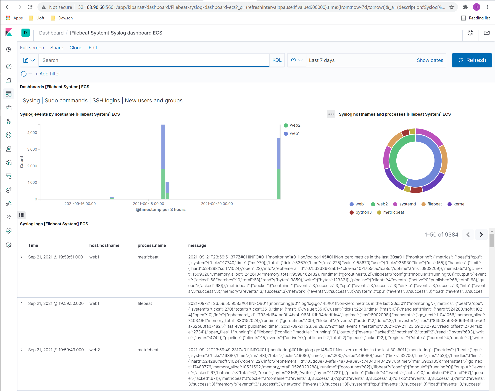
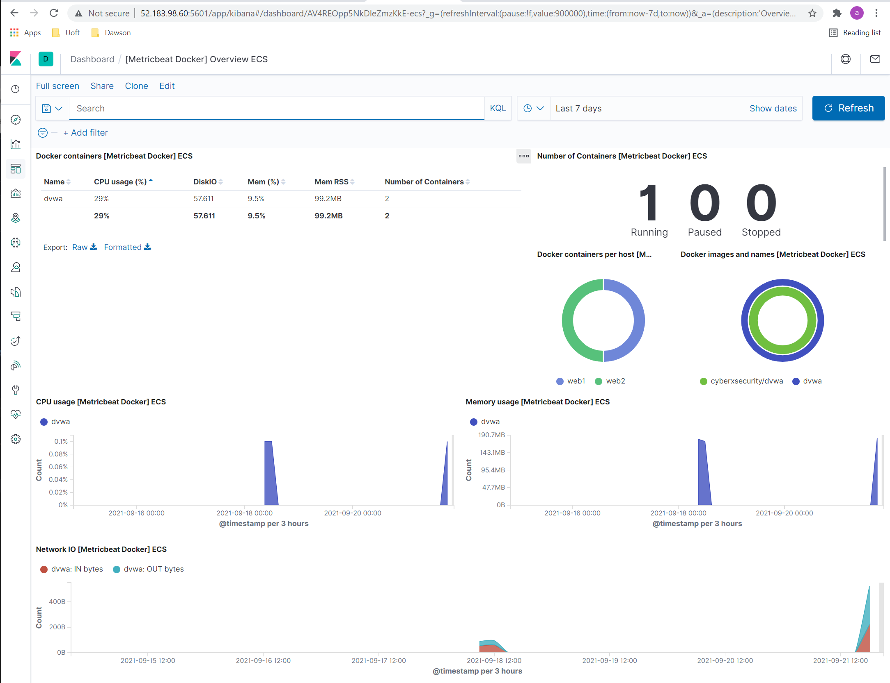

## Automated ELK Stack Deployment

The files in this repository were used to configure the network depicted below.


These files have been tested and used to generate a live ELK deployment on Azure. They can be used to either recreate the entire deployment pictured above. Alternatively, select portions of the file may be used to install only certain pieces of it, such as Filebeat or Metricbeat.

filebeat-playbook
``` yml
- name: installing and launching filebeat
  hosts: webservers
  become: yes
  tasks:

  - name: download filebeat deb
    command: curl -L -O https://artifacts.elastic.co/downloads/beats/filebeat/filebeat-7.6.1-amd64.deb

  - name: install filebeat deb
    command: dpkg -i filebeat-7.6.1-amd64.deb

  - name: drop in filebeat.yml
    copy:
      src: /etc/ansible/files/filebeat-config.yml
      dest: /etc/filebeat/filebeat.yml

  - name: enable and configure system module
    command: filebeat modules enable system

  - name: setup filebeat
    command: filebeat setup

  - name: start filebeat service
    command: service filebeat start

  - name: enable service filebeat on boot
    systemd:
      name: filebeat
      enabled: yes
```

metricbeat-playbook
``` yml
---
- name: installing and launching metricbeat
  hosts: webservers
  become: yes
  tasks:

  - name: download metricbeat deb
    command: curl -L -O https://artifacts.elastic.co/downloads/beats/metricbeat/metricbeat-7.4.0-amd64.deb

  - name: install metricbeat
    command: dpkg -i metricbeat-7.4.0-amd64.deb

  - name: copy metricbeat config file
    copy:
      src: /etc/ansible/files/metricbeat-config.yml
      dest: /etc/metricbeat/metricbeat.yml

  - name: metricbeat modules enable docker
    command: metricbeat modules enable docker

  - name: metricbeat setup
    command: metricbeat setup

  - name: metricbeat -e
    command: metricbeat -e

  - name: enable service metric beat on boot
    systemd:
      name: metricbeat
      enabled: yes
```


This document contains the following details:
- Description of the Topology
- Access Policies
- ELK Configuration
  - Beats in Use
  - Machines Being Monitored
- How to Use the Ansible Build


### Description of the Topology

The main purpose of this network is to expose a load-balanced and monitored instance of DVWA, the D*mn Vulnerable Web Application.

Load balancing ensures that the application will be highly available, in addition to restricting access to the network.
- Load Balancing plays an important security role as computing moves evermore to the cloud. The off-loading function of a load balancer defends an organization against distributed denial-of-service (DDoS) attacks.
- The advantage of a jump box is 

Integrating an ELK server allows users to easily monitor the vulnerable VMs for changes to the containers and system files.
- Filebeat is a lightweight shipper for forwarding and centralizing log data. Installed as an agent on your servers, Filebeat monitors the log files or locations that you specify, collects log events, and forwards them either to Elasticsearch or Logstash for indexing.
- Metricbeat is a lightweight shipper that you can install on your servers to periodically collect metrics from the operating system and from services running on the server. Metricbeat takes the metrics and statistics that it collects and ships them to the output that you specify, such as Elasticsearch or Logstash.

The configuration details of each machine may be found below.
_Note: Use the [Markdown Table Generator](http://www.tablesgenerator.com/markdown_tables) to add/remove values from the table_.

| Name     | Function           | IP Address | Operating System |
|----------|--------------------|------------|------------------|
| Jump Box | Gateway            | 10.0.0.1   | Linux            |
| Web1     | dvwa container     | 10.0.0.5   | Linux            |
| Web2     | dvwa container     | 10.0.0.6   | Linux            |
| Elk      | elk  container     | 10.1.0.6   | Linux            |

### Access Policies

The machines on the internal network are not exposed to the public Internet. 

Only the jumpbox machine can accept connections from the Internet. Access to this machine is only allowed from the following IP addresses:
``` yml
172.97.232.206
```

Machines within the network can only be accessed by jumpbox.
- _TODO: Which machine did you allow to access your ELK VM? What was its IP address?_

A summary of the access policies in place can be found in the table below.

| Name     | Publicly Accessible | Allowed IP Addresses |
|----------|---------------------|----------------------|
| Jump Box | Yes                 | 10.0.0.1 10.0.0.2    |
|          |                     |                      |
|          |                     |                      |

### Elk Configuration

Ansible was used to automate configuration of the ELK machine. No configuration was performed manually, which is advantageous because...
- Simple and easy to learn -> supported by clear documentation and run sequentially
- Agentless -> it handles all master/agent communications with standard ssh
- YAML-Bases playbooks -> it's easier to read, support comments and employs the use of anchors for referencing other items


The playbook implements the following tasks:
- install Docker and configure virtual memory
- download elk docker container
- enable docker on restart

install-elk.yml
``` yml
---
- name: Configure Elk VM with Docker
  hosts: elk
  remote_user: webadmin
  become: true
  tasks:
    # Use apt module
    - name: Install docker.io
      apt:
        update_cache: yes
        force_apt_get: yes
        name: docker.io
        state: present

      # Use apt module
    - name: Install python3-pip
      apt:
        force_apt_get: yes
        name: python3-pip
        state: present

      # Use pip module (It will default to pip3)
    - name: Install Docker module
      pip:
        name: docker
        state: present

      # Use command module
    - name: Increase virtual memory
      command: sysctl -w vm.max_map_count=262144

      # Use sysctl module
    - name: Use more memory
      sysctl:
        name: vm.max_map_count
        value: 262144
        state: present
        reload: yes

      # Use docker_container module
    - name: download and launch a docker elk container
      docker_container:
        name: elk
        image: sebp/elk:761
        state: started
        restart_policy: always
        # Please list the ports that ELK runs on
        published_ports:
          -  5601:5601
          -  9200:9200
          -  5044:5044

      # Use systemd module
    - name: Enable service docker on boot
      systemd:
        name: docker
        enabled: yes
```

The following screenshot displays the result of running `docker ps` after successfully configuring the ELK instance.


### Target Machines & Beats
This ELK server is configured to monitor the following machines:
| Name     | IP Address | Operating System |
|----------|------------|------------------|
| Web1     | 10.0.0.5   | Linux            |
| Web2     | 10.0.0.6   | Linux            |

We have installed the following Beats on these machines:
| Name     | IP Address | Beats                 |
|----------|------------|-----------------------|
| Web1     | 10.0.0.5   | Filebeat & Metricbeat |
| Web2     | 10.0.0.6   | Filebeat & Metricbeat |

These Beats allow us to collect the following information from each machine:
- _TODO: In 1-2 sentences, explain what kind of data each beat collects, and provide 1 example of what you expect to see. E.g., `Winlogbeat` collects Windows logs, which we use to track user logon events, etc._

### Using the Playbook
In order to use the playbook, you will need to have an Ansible control node already configured. Assuming you have such a control node provisioned: 

SSH into the control node and follow the steps below:
- Copy the _____ file to _____.
- Update the _____ file to include...
- Run the playbook, and navigate to ____ to check that the installation worked as expected.

_TODO: Answer the following questions to fill in the blanks:_
- _Which file is the playbook? Where do you copy it?_
- _Which file do you update to make Ansible run the playbook on a specific machine? How do I specify which machine to install the ELK server on versus which to install Filebeat on?_
- _Which URL do you navigate to in order to check that the ELK server is running?






_As a **Bonus**, provide the specific commands the user will need to run to download the playbook, update the files, etc._